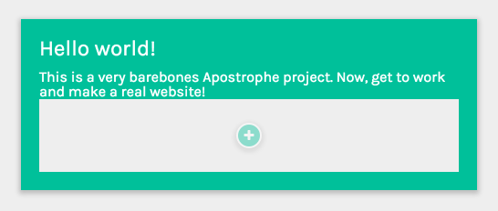
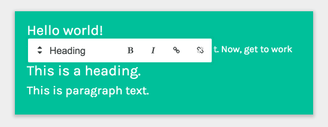
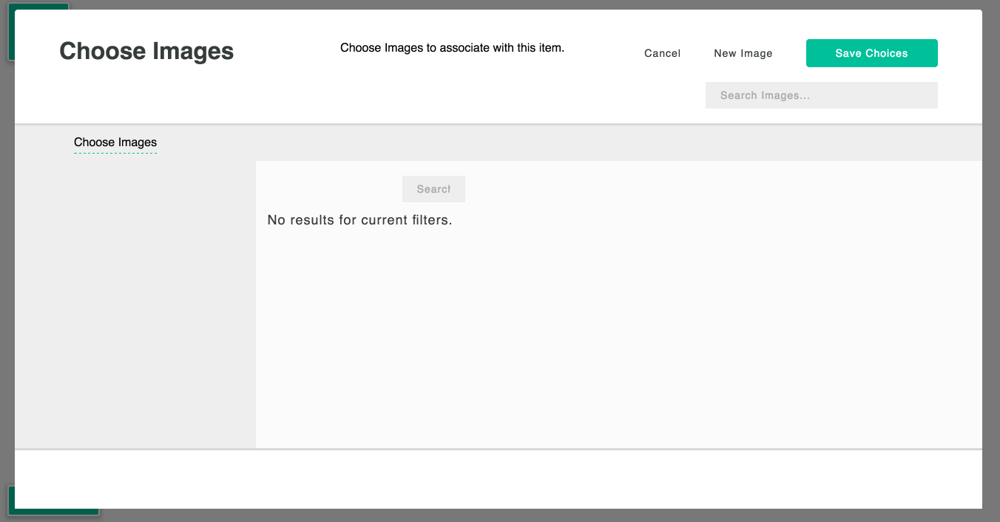
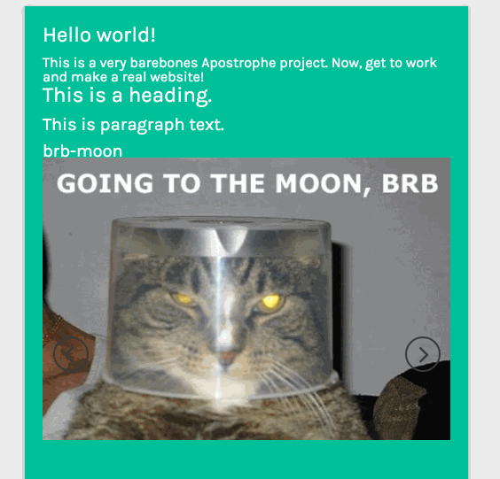

# 创建你的第一个项目

---------------------------------

已安装完所需的配置环境后，可以开始建立你的第一个apostrophe站点了。

### 生成测试程序

首先安装`apostrophe-cli`工具

```
# 全局安装apostrophe-cli模块
npm install apostrophe-cli -g
```

```
# 创建一个项目
apostrophe create-project test-project

# 或者你可以安装一个健壮的、主体化的、完全成熟的项目
apostrophe create-project --boilerplate https://github.com/apostrophecms/apostrophe-open-museum test-project

```

> 重要提示：不要使用`test-project`名称，而是使用你自己的项目'short name'，其中只包含字母、数字、连字符和‘/’或下划线。默认情况下，它将MongoDB数据库名称和cookie名称的基础。

```
# 进入到新文件夹
cd test-project
# 安装依赖包
npm install
# 将管理用户添加到管理组；提示输入密码
node app.js apostrophe-users:add admin admin
# 开始
node app.js
```

你现在有一个测试项目启动并运行了。你可以访问http://localhost:3000 并查看你的站点，你会看到一个非常简单的主页。so simple~ 稍后通过添加更多的页面类型和一些可编辑区域来解决这个问题。

[](../../images/gs-first.png)
样板主页


#### 登录

我们可以通过浏览器`http://localhost:3000/login`登录。使用刚才运行`apostrophe-user:add`时选择的密码-用户。

一旦登录，我们将再次被重定向到主页，但是有两个额外的元素： 一个管理栏浮动在页面的左上角，一个页面菜单浮动在页面左下角。
[](../../images/gs2.png)
登录到样板文件


#### make in ineresting

向页面添加可编辑内容区域。

打开`lib/modules/apostrophe-pages/views/home.html` 和添加`apos.area`如下：

```


 Home

  <div class="main-content">
    <h3>Hello world!
      
        <a class="login-link">Login</a>
      
    </h3>
  </div>
  <p>This is a very barebones Apostrophe project. Now, get to work and make a real website!</p>
  {{ apos.area(data.page, 'body', {
    widgets: {
      'apostrophe-images': {
        size: 'full'
      },
      'apostrophe-rich-text': {
        toolbar: ['Styles'， 'Bold', 'Italic', 'Link', 'Unlink'],
        styles: [
          {name: 'Heading', element: 'h3'},
          {name: 'Subheading', element: 'h4'},
          {name: 'Paragraph', element: 'p'}
        ]
      }
    }
  })

  }}
</div>


```

#### 重启站点

现在重启站点，可以看到修改的变化


#### 使用Nodemon查看文件的变化
为了避免将来手动重启，你可以使用Nodemon查看项目文件。

1. 全局安装nodemon `npm install -g nodemon`
2. 在项目根文件夹中使用nodemon。nodemon将默认运行`node app.js`

现在，每当你对项目中的文件进行更改时，nodemon都会重启你的应用程序。

如果你是按照以上使用`apostrophe-cli`安装apostrophe的，这个包`nodemon`提供了一个基本的nodemon配置文件`package.json`


#### 工作区域

以下这个新按钮是什么作用？



*添加富文本*
点击“+”并选择"富文本（rich text）"。会看到一个友好的编辑：


编辑你认为适合的，并尝试刷新你的页面。你的更改时自动保存的。


#### 添加轮播

现在我们添加一个轮播例子。单击富文本编辑器外，你可以看到两个新的“+”符号： 一个在文本上方，一个在文本下方。点击其中一个并选择“图像(image(s))”

可以看到图像库，它最初是空的：



点击右上角的"新建图像(New Image)"按钮，你会看到：


点击"上传文件(Upload File)"，选择一个gif/jpeg/png文件从电脑上传。还需要填写title字段。然后点击"保存图像(Save Image)".

再次点击"新建图片(New Image)"并上传第二个文件。然后在他们旁边的方框中勾选：


(当你勾选他们时，你会看到他们出现在左边的"选择项(chosen items)"区域)

点击"保存选择(Save choices)"，弹出如下效果：




